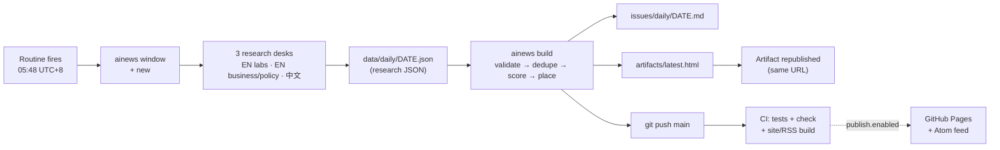

# AI Daily

A daily AI-news digest, researched every morning at **06:00 UTC+8** by a Claude Code routine, scored with an
explicit importance model, archived here, and published as a living dashboard.

**Read it:** [dashboard](https://claude.ai/artifact/JWKqbkjDyRY4pGhrJpgjz5) (private artifact, one URL, updated
daily) · [`issues/daily/`](issues/daily) (Markdown archive) · [`issues/weekly/`](issues/weekly) (Monday recaps)

| | |
|---|---|
| Schedule | daily, cron `48 21 * * *` UTC = 05:48 UTC+8; issue ready ≈ 06:15 |
| Window | previous run → now (rolling, gap-free), deduplicated against the last 7 days |
| Per issue | TL;DR · 5 lead stories · ~10 briefs · upcoming calendar · "this week so far" (minor) · also noted |
| Weekly | Monday issue adds a Mon–Sun recap: 3–4 themes, top 10, topic mix, entity leaderboard |
| Beats | models, labs & open weights · research · products & agents · business & funding · compute & chips · policy & safety |
| Sources | primary-first; Chinese-language sources translated to English (original headline kept) |
| Ranking | $I = 100\sum_k w_k s_k$ over impact, novelty, credibility, breadth, momentum ([METHODOLOGY.md](METHODOLOGY.md)) |

## How it works



Claude does the part that needs judgement: finding, verifying, translating and summarising stories, and setting the
two rubric scores. Everything after the research JSON is deterministic Python (stdlib only, 3.11+). CI can therefore
rebuild every generated file and fail on any drift or hand edit.

## Repository layout

```
config.toml            tunables: schedule, weights, tier reliabilities, lead count, artifact URL, publish flag
sources.toml           research checklist + domain → tier map (EN + 中文)
RUNBOOK.md             the routine's step-by-step instructions
METHODOLOGY.md         scoring, placement, window and dedupe maths
ainews/                pipeline package (python3 -m ainews …)
  config.py archive.py timewin.py validate.py dedupe.py scoring.py aggregate.py
  render_md.py dashboard.py site.py cli.py templates/dashboard.html
data/daily/DATE.json   research + scores (source of truth)
data/weekly/WEEK.json  weekly themes (+ back-fill items for weeks without dailies)
issues/                generated Markdown (do not edit)
artifacts/latest.html  generated living dashboard (do not edit)
scripts/calibration.py score-component spread and correlation report
tests/                 unittest suite (no dependencies)
```

## Commands

```bash
python3 -m ainews window                 # next window, recent items to avoid, open calendar
python3 -m ainews new                    # create today's research JSON skeleton
python3 -m ainews build [DATE]           # validate → dedupe → score → Markdown + dashboard
python3 -m ainews weekly 2026-W40        # weekly recap (Mondays)
python3 -m ainews summary                # push-notification text
python3 -m ainews check                  # CI: validate all + verify generated files are reproducible
python3 -m ainews site --out site        # static site + Atom feed
python3 -m unittest discover -s tests    # tests
python3 scripts/calibration.py           # is each score component still discriminating?
```

## Publishing (built, switched off)

`python3 -m ainews site` renders `site/`: the dashboard as `index.html`, one static page per daily and weekly issue,
`archive.html` and an Atom `feed.xml`. CI builds it on every push. To go live:

1. Set `[publish] enabled = true` and `site_url` in `config.toml`.
2. **GitHub Pages:** this repo is private, so Pages needs GitHub Pro (or make the repo public). Then go to
   Settings → Pages → Source: GitHub Actions. The `deploy` job in `.github/workflows/ci.yml` does the rest.
3. **Cloudflare Pages (works with private repos on the free plan):** build command
   `python3 -m ainews site --out site`, output directory `site`.

## Tuning

Edit `config.toml` and run `python3 -m ainews check`. If scores changed, CI will ask you to rebuild the affected
issues (`python3 -m ainews build DATE`). After a few weeks, run `scripts/calibration.py`: components flagged
"near-constant" are wasting their weight.
