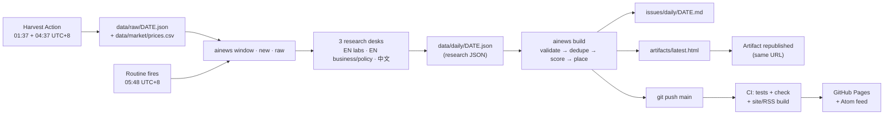

# AI Daily

A daily AI-news digest, researched every morning at **06:00 UTC+8** by a Claude Code routine, scored with an
explicit importance model, archived here, and published as a living dashboard.

**Read it:** [leevvyy.github.io/ai-news](https://leevvyy.github.io/ai-news/) (public site) ·
[Atom feed](https://leevvyy.github.io/ai-news/feed.xml) · [`issues/daily/`](issues/daily) (Markdown archive) ·
[`issues/weekly/`](issues/weekly) (Monday recaps) · the owner's private
[dashboard artifact](https://claude.ai/artifact/JWKqbkjDyRY4pGhrJpgjz5)

| | |
|---|---|
| Schedule | daily, cron `48 21 * * *` UTC = 05:48 UTC+8; issue ready ≈ 06:15 |
| Window | previous run → now (rolling, gap-free), deduplicated against the last 7 days |
| Per issue | TL;DR · 5 lead stories · ~10 briefs · upcoming calendar · "this week so far" (minor) · also noted |
| Weekly | Monday issue adds a Mon–Sun recap: 3–4 themes, top 10, topic mix, entity leaderboard |
| Beats | models, labs & open weights · research · products & agents · business & funding · compute & chips · policy & safety |
| Sources | primary-first; Chinese-language sources translated to English (original headline kept) |
| Ranking | $I = 100\sum_k w_k s_k$ over impact, novelty, credibility, breadth, momentum ([METHODOLOGY.md](METHODOLOGY.md)) |
| China desk | ≥ 2 China stories among leads + briefs (visible "quota pick" swaps) plus a 中国 desk section |
| Markets | tickers in the news get a market-model event study: AR by session, CAR[0,2], t-stat; weekly mean CAR by topic with a 95% CI |
| Harvester | nightly GitHub Action pulls ~35 feeds/APIs (EN + 中文, Google News, HF papers, HN) and prices, because the routine's sandbox cannot reach them |

## How it works



Claude does the part that needs judgement: finding, verifying, translating and summarising stories, and setting the
two rubric scores. Everything after the research JSON is deterministic Python (stdlib only, 3.11+). CI can therefore
rebuild every generated file and fail on any drift or hand edit.

## Repository layout

```
config.toml            tunables: schedule, weights, tier reliabilities, lead count, artifact URL, publish flag
sources.toml           research checklist + domain → tier map (EN + 中文)
feeds.toml             harvester sources (RSS/Atom, Google News queries, HF papers, HN)
RUNBOOK.md             the routine's step-by-step instructions
METHODOLOGY.md         scoring, placement, window and dedupe maths
ainews/                pipeline package (python3 -m ainews …)
  config.py archive.py timewin.py validate.py dedupe.py scoring.py aggregate.py market.py harvest.py
  render_md.py dashboard.py site.py cli.py templates/dashboard.html
data/daily/DATE.json   research + scores (source of truth)
data/weekly/WEEK.json  weekly themes (+ back-fill items for weeks without dailies)
data/raw/DATE.json     nightly harvest (30-day retention in the tree)
data/market/prices.csv tidy daily closes for tickers in the news + benchmarks
issues/                generated Markdown (do not edit)
artifacts/latest.html  generated living dashboard (do not edit)
scripts/calibration.py score-component spread and correlation report
tests/                 unittest suite (no dependencies)
```

## Commands

```bash
python3 -m ainews window                 # next window, recent items to avoid, open calendar
python3 -m ainews new                    # create today's research JSON skeleton
python3 -m ainews build [DATE]           # validate → dedupe → score → Markdown + dashboard
python3 -m ainews weekly 2026-W40        # weekly recap (Mondays)
python3 -m ainews summary                # push-notification text
python3 -m ainews check                  # CI: validate all + verify generated files are reproducible
python3 -m ainews site --out site        # static site + Atom feed
python3 -m ainews raw                    # digest of the latest nightly harvest
python3 -m ainews harvest                # (network, GitHub Actions) feeds → data/raw, prices → data/market
python3 -m ainews render                 # re-render all generated files after a price update
python3 -m unittest discover -s tests    # tests
python3 scripts/calibration.py           # is each score component still discriminating?
```

## Publishing

Publishing is **on** (`[publish] enabled = true`). Every push to `main` (including the routine's daily commit) runs CI,
which renders `site/` with `python3 -m ainews site` and deploys it to GitHub Pages at
<https://leevvyy.github.io/ai-news/>. The site contains:

* `index.html`: the dashboard, embedding the last 30 days
* `daily/DATE.html` and `weekly/WEEK.html`: one static page per issue, without JavaScript
* `archive.html`: every issue
* `feed.xml`: an Atom feed with one entry per daily and weekly issue

One-time repository settings this needs: the repo is **public** (Pages on a private repo needs GitHub Pro), and
**Settings → Pages → Build and deployment → Source** is set to **GitHub Actions**. To pause publishing, set
`enabled = false`: CI keeps building the site as a check but stops deploying it.

## Tuning

Edit `config.toml` and run `python3 -m ainews check`. If scores changed, CI will ask you to rebuild the affected
issues (`python3 -m ainews build DATE`). After a few weeks, run `scripts/calibration.py`: components flagged
"near-constant" are wasting their weight.
